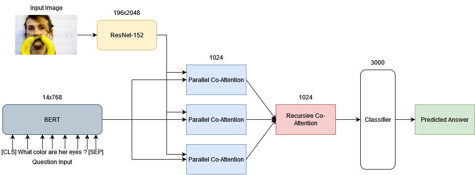

# BERT based Co-Attention Networks for Visual Question Answering

This repository contains the Keras implementation for the models trained for [Visual Question Answering (VQA)](https://visualqa.org/index.html). The model architecture and other details are discussed in our paper [BERT based Multiple Parallel Co-attention Model for Visual Question Answering](https://ieeexplore.ieee.org/document/9788253).

The models currently implemented for training and evaluation (scores are on the VQA v2.0 *val* split) are:

| Model                                           | Yes/No    | Number    | Other     | All       |
|-------------------------------------------------|-----------|-----------|-----------|-----------|
| BERT based Hierarchical Co-Attention            | 69.36     | 34.61     | 44.4      | 52.49     |
| BERT based HieCoAtt w/ Shared Co-Attention      | 73.36     | 36.79     | 43.66     | 54.03     |
| BERT based Multiple Parallel Co-Attention       | 76.44     | 37.24     | 48.15     | 57.84     |
| BERT based Multiple Parallel Co-Attention Large | **76.97** | **37.45** | **49.61** | **58.29** |



## Table of Contents
0. [Setup](#Setup)
1. [Training](#Training)
2. [Evaluation](#Evaluation)
3. [Credit](#Credit)
4. [Citation](#Citation)

## Setup

#### Hardware Requirements
You will need a machine with 1 GPU (minimum 4GB VRAM), 8-16GB RAM, and 100-250GB free disk space. We recommend using a SSD drive especially for high-speed I/O during training.

#### Software Requirements
Implementation was done in [Python](https://www.python.org/downloads/) 3.10. We use [CUDA](https://developer.nvidia.com/cuda-toolkit-archive) version 11.2 and [cuDNN](https://developer.nvidia.com/cudnn) version 8.1. We use [Tensorflow](https://www.tensorflow.org/install) version 2.8.0 for training.
Install necessary packages using:
```commandline
pip install -r requirements.txt
```

#### Dataset
We use the VQA v2.0 dataset provided [here](https://visualqa.org/download.html) for training and testing. Download all files for questions, answers and images and extract and store them in the `data` folder as shown:
```html
|-- data
	|-- train
	|  |-- train2014
	|  |  |-- COCO_train2014_...jpg
	|  |  |-- ...
	|  |-- v2_OpenEnded_mscoco_train2014_questions.json
	|  |-- v2_mscoco_train2014_annotations.json
	|-- validate
	|  |-- val2014
	|  |  |-- COCO_val2014_...jpg
	|  |  |-- ...
	|  |-- v2_OpenEnded_mscoco_val2014_questions.json
	|  |-- v2_mscoco_val2014_annotations.json
	|-- test
	|  |-- test2015
	|  |  |-- COCO_test2015_...jpg
	|  |  |-- ...
	|  |-- v2_OpenEnded_mscoco_test2015_questions.json
```

## Training
The following script will start training with the default parameters:
```commandline
python run.py --RUN train --CONFIG bert_mcoatt
```

#### Training Parameters
See `python run.py -h` for more details.
1. `--RUN=str` for mode to run in. Either `'train', 'eval' or 'test'`.
2. `--CONFIG=str` loads the yaml config file to use for building the model. See `configs/` for config files for the models given in our paper.
3. `--VERSION=str` for which model version to load either for resuming training or for evaluation.
4. `--EVAL=True` for whether we evaluate the model after training is done.
5. `--PRELOAD=True` loads all image features directly into memory. Only do this if you have sufficient RAM.
6. `--DATA_DIR=str` for where the dataset and other files are stored. Default is `data/`.
7. `--OUTPUT_DIR=str` for where the results are saved. Default is `results/`.
8. `--CHECKPOINT_DIR=str` for where the model checkpoints are saved. Default is `checkpoints/`.
9. `--FEATURES_DIR=str` for where the image features are stored. Default is `data/{feature_type}`.

## Evaluation
The following script will start evaluation:
```commandline
python run.py --RUN eval --CONFIG bert_mcoatt --VERSION {str} --START_EPOCH {int}
```
Validation only works for the VQA v2.0 *val* split. For test set evaluation run the following script:
```commandline
python run.py --RUN test --CONFIG bert_mcoatt --VERSION {str} --START_EPOCH {int}
```
The results file stored in `results/bert_mcoatt_{version}_results.json` can then be uploaded to [Eval AI](https://evalai.cloudcv.org/web/challenges/challenge-page/163/overview) to get the scores on the *test-dev* and *test-std* splits.

## Credit
VQA Consortium for providing the [VQA v2.0 dataset](https://visualqa.org/index.html) and the API and evaluation code located at `utils/vqaEvaluation` and `utils/vqaTools` available [here](https://github.com/GT-Vision-Lab/VQA) and licensed under the MIT license.

[Hierarchical Question-Image Co-Attention for Visual Question Answering](https://github.com/jiasenlu/HieCoAttenVQA) for providing their code and implementation. You can see their paper [here](https://arxiv.org/abs/1606.00061). 

[BERT (Bidirectional Encoder Representations from Transformers)](https://github.com/google-research/bert) for providing their pretrained language models. You can their papers [here](https://arxiv.org/abs/1810.04805) and [here](https://arxiv.org/abs/1908.08962).

[Hugging Face Transformers library](https://github.com/huggingface/transformers) for providing the BERT implementation interface to use in Keras/Tensorflow.

[Deep Modular Co-Attention Networks (MCAN)](https://github.com/MILVLG/mcan-vqa) for providing inspiration for the training/evaluation interface.

## Citation
If this repository was useful for your work, it would be greatly appreciated if you could cite the following paper:
```
@INPROCEEDINGS{9788253,
    author={Dias, Mario and Aloj, Hansie and Ninan, Nijo and Koshti, Dipali},
    booktitle={2022 6th International Conference on Intelligent Computing and Control Systems (ICICCS)},
    title={BERT based Multiple Parallel Co-attention Model for Visual Question Answering},
    year={2022},
    pages={1531-1537},
    doi={10.1109/ICICCS53718.2022.9788253}
}
```